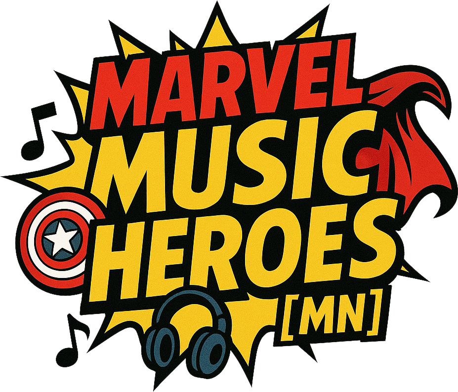

# 🎵 Marvel Music Quiz! 🦸‍♂️

  
  
  
  
  
  

  *"Test your knowledge of the Marvel Cinematic Universe's most iconic songs!"*

## ⚡ About

Marvel Music Quiz is a real-time multiplayer game where Marvel fans compete to identify songs from the Marvel Cinematic Universe. From the classic rock hits of Iron Man to the awesome mixes of Guardians of the Galaxy, test your knowledge against friends!

## 🚀 Features

- **🎮 Real-time Multiplayer**: Create rooms and play with friends
- **🎵 Rich Song Library**: 100+ iconic songs from the MCU
- **🎨 Comic Book Style UI**: Immersive Marvel-themed interface
- **🏆 Scoring System**: Compete for the highest score
- **🌓 Dark/Light Mode**: Choose your preferred theme
- **📱 Responsive Design**: Play on any device

## 🎯 How to Play

1. **Create or Join a Room**
   - Create a new game room
   - Choose number of rounds
   - Share room code with friends

2. **Choose Your Hero**
   - Pick your superhero name
   - Select your player color

3. **Play the Game**
   - Listen to song clips
   - Guess the correct movie/character
   - Score points for correct answers
   - Compete with friends!

## 🛠️ Tech Stack

- **Frontend**: Next.js, TypeScript, TailwindCSS
- **Real-time**: Socket.io
- **Styling**: Shadcn/ui, Lucide Icons
- **Animations**: Custom Comic Effects

## 🏃‍♂️ Running Locally

\`\`\`bash
# Clone the repository
git clone https://github.com/yourusername/marvel-music-quiz.git

# Navigate to project directory
cd marvel-music-quiz

# Install dependencies
npm install

# Start development server
npm run dev
\`\`\`

Visit [http://localhost:3000](http://localhost:3000) to start playing!

## 🎮 Game Modes

- **Quick Game**: 5 rounds
- **Standard Game**: 10 rounds
- **Extended Game**: 15 rounds
- **Marathon Mode**: 20 rounds
- **Ultimate Challenge**: 30 rounds

## 🎵 Music Categories

- Iron Man's Classic Rock
- Guardians' Awesome Mix
- Thor's Epic Themes
- Black Panther's Beats
- Doctor Strange's Psychedelic Sounds
- And many more!

## 🦸‍♀️ Contributing

Feel free to contribute to this project! Whether it's:
- Adding new features
- Fixing bugs
- Improving documentation
- Adding more songs

Check our [Contributing Guidelines](CONTRIBUTING.md) for more information.

## 📜 License

This project is licensed under the MIT License - see the [LICENSE](LICENSE) file for details.

## ⭐ Credits

- All music rights belong to their respective owners
- Marvel and all related characters are trademarks of Marvel Entertainment, LLC
- Special thanks to all contributors and the Marvel fan community!

---

  Made with ❤️ by Marvel fans, for Marvel fans!
  
  *"Part of the journey is the end... of the song!"*

